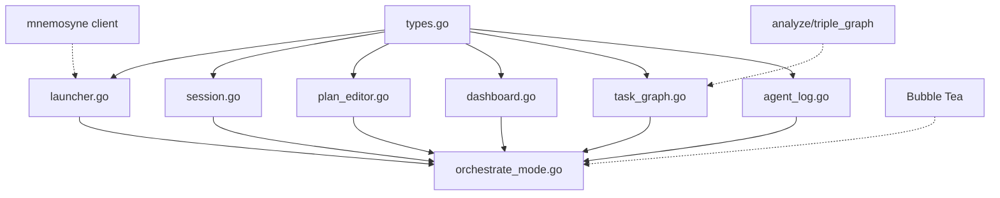

# Phase 7 Component Decomposition

**Phase**: 7 (Orchestrate Mode)
**Status**: Planning → Implementation
**Date**: 2025-11-09

## Component Breakdown

Based on PHASE7_SPEC.md, here's the detailed decomposition with dependencies and typed holes.

## Component Dependency Graph



## Components (Ordered by Dependencies)

### 1. Core Types (`types.go`)
**Lines**: ~200
**Dependencies**: None
**Priority**: Critical Path

**Typed Holes**:
```go
type WorkPlan interface {
    ?[Validate: Ensure DAG has no cycles]
    ?[ToDependencyGraph: Convert to graph representation]
    ?[ToJSON: Serialize to mnemosyne format]
}

type AgentEvent interface {
    ?[Parse: Parse from mnemosyne stdout]
    ?[Format: Human-readable string]
}

type AgentStatus interface {
    ?[IsActive: Check if agent is currently working]
    ?[CanExecute: Check if task can be assigned]
}
```

**Deliverables**:
- `WorkPlan` struct with validation
- `Task` struct with dependency tracking
- `AgentEvent` with parsing logic
- `AgentStatus` enumeration
- `AgentType` enumeration
- `SessionState` struct
- JSON marshaling/unmarshaling

**Tests**: 15 tests (validation, cycles, parsing, marshaling)

---

### 2. Launcher (`launcher.go`)
**Lines**: ~250
**Dependencies**: types.go, mnemosyne client
**Priority**: Critical Path

**Typed Holes**:
```go
type Launcher interface {
    ?[Start: Spawn mnemosyne orchestrate subprocess]
    ?[CaptureEvents: Stream stdout/stderr to event channel]
    ?[GracefulShutdown: Send SIGTERM, wait, force kill]
}
```

**Deliverables**:
- `Launcher` struct
- Process management (start, stop, restart)
- Stdout/stderr capture with buffering
- Event channel streaming
- Error handling and recovery

**Tests**: 12 tests (lifecycle, events, errors, cleanup)

---

### 3. Session Management (`session.go`)
**Lines**: ~200
**Dependencies**: types.go
**Priority**: High

**Typed Holes**:
```go
type Session interface {
    ?[Persist: Save state to disk atomically]
    ?[Restore: Load state from disk with validation]
    ?[UpdateProgress: Track task completion]
}
```

**Deliverables**:
- `Session` struct with metadata
- Session persistence (JSON to `~/.pedantic_raven/sessions/`)
- Session history tracking
- Progress calculation
- Session lifecycle events

**Tests**: 10 tests (persist, restore, corruption, history)

---

### 4. Plan Editor (`plan_editor.go`)
**Lines**: ~300
**Dependencies**: types.go, Bubble Tea
**Priority**: Medium (can develop in parallel)

**Typed Holes**:
```go
type PlanEditor interface {
    ?[ValidateLive: Real-time validation as user types]
    ?[SyntaxHighlight: JSON syntax highlighting]
    ?[AutoComplete: Suggest task IDs for dependencies]
}
```

**Deliverables**:
- `PlanEditor` Bubble Tea model
- Text editing with cursor management
- JSON validation with error highlighting
- Save/load file operations
- Example plan templates (3-5 templates)

**Tests**: 8 tests (editing, validation, save/load)

---

### 5. Dashboard (`dashboard.go`)
**Lines**: ~350
**Dependencies**: types.go, Bubble Tea
**Priority**: Critical Path

**Typed Holes**:
```go
type Dashboard interface {
    ?[RenderAgentStatus: 4-panel layout with live updates]
    ?[CalculateMetrics: Progress, success rate, ETA]
    ?[HandleEvents: Update UI from event stream]
}
```

**Deliverables**:
- `Dashboard` Bubble Tea model
- 4-agent status panel
- Progress indicators (bars, percentages)
- Task queue visualization
- Metrics display (elapsed time, success rate)
- Auto-refresh at configurable interval

**Tests**: 10 tests (rendering, events, metrics)

---

### 6. Task Graph (`task_graph.go`)
**Lines**: ~400
**Dependencies**: types.go, analyze/triple_graph (for force layout), Bubble Tea
**Priority**: Medium (can develop in parallel)

**Typed Holes**:
```go
type TaskGraph interface {
    ?[BuildDAG: Convert task list to directed graph]
    ?[DetectCycles: Validate no circular dependencies]
    ?[ApplyForceLayout: Position nodes using physics]
    ?[RenderGraph: Draw nodes and edges on canvas]
}
```

**Deliverables**:
- `TaskGraph` Bubble Tea model
- DAG construction from WorkPlan
- Cycle detection algorithm (DFS with back edges)
- Force-directed layout (reuse from internal/analyze/triple_graph.go)
- Node rendering (colored by status: pending/active/done/failed)
- Edge rendering (arrows for dependencies)
- Pan/zoom controls (h/j/k/l, +/-)

**Tests**: 12 tests (DAG, cycles, layout, rendering, navigation)

---

### 7. Agent Log Viewer (`agent_log.go`)
**Lines**: ~250
**Dependencies**: types.go, Bubble Tea
**Priority**: Low (can develop last)

**Typed Holes**:
```go
type AgentLog interface {
    ?[FilterByAgent: Show only specific agent's logs]
    ?[SearchLogs: Regex search through log history]
    ?[ExportLogs: Write to file with formatting]
}
```

**Deliverables**:
- `AgentLog` Bubble Tea model
- Scrollable log buffer (circular buffer, max 10,000 lines)
- Color-coded log levels (info=blue, warn=yellow, error=red)
- Filter by agent type
- Search functionality (regex)
- Export to file

**Tests**: 8 tests (buffering, filtering, search, export)

---

### 8. Orchestrate Mode (`orchestrate_mode.go`)
**Lines**: ~500
**Dependencies**: All above components, Bubble Tea
**Priority**: Critical Path (Integration)

**Typed Holes**:
```go
type OrchestrateMode interface {
    ?[CoordinateViews: Switch between 4 views with shared state]
    ?[ManageSession: Handle session lifecycle events]
    ?[PropagateEvents: Route agent events to active view]
}
```

**Deliverables**:
- `OrchestrateMode` Bubble Tea model
- View switching (Tab/Shift+Tab, 1/2/3/4)
- Keyboard shortcut handling
- Session coordination
- Event routing to child components
- Header/footer rendering
- Help overlay (?)

**Tests**: 15 tests (navigation, events, views, session lifecycle)

---

## Dependency Resolution

### Critical Path (Must be Sequential)
1. **types.go** (Day 1) → foundation for all other components
2. **launcher.go** (Day 2-3) → required for dashboard to have events
3. **session.go** (Day 3) → can overlap with launcher
4. **dashboard.go** (Day 4-5) → needs launcher events
5. **orchestrate_mode.go** (Day 11-12) → integrates everything

### Parallel Streams

**Stream A** (UI Components):
- Day 4: `plan_editor.go` (independent)
- Day 6-7: `task_graph.go` (needs types.go)
- Day 8: `agent_log.go` (needs types.go)

**Stream B** (Core Infrastructure):
- Day 2-3: `launcher.go` (needs types.go)
- Day 3: `session.go` (needs types.go)
- Day 4-5: `dashboard.go` (needs launcher.go)

**Stream C** (Testing & Docs):
- Day 14: All tests (can write tests in parallel with implementation)
- Day 15: Documentation (after all features complete)

## Typed Holes Summary

| Component | Typed Holes | Complexity |
|-----------|-------------|------------|
| types.go | 3 | Medium |
| launcher.go | 3 | High |
| session.go | 3 | Medium |
| plan_editor.go | 3 | Medium |
| dashboard.go | 3 | High |
| task_graph.go | 4 | High |
| agent_log.go | 3 | Low |
| orchestrate_mode.go | 3 | High |
| **Total** | **25** | **- - -** |

## Constraints & Invariants

### Performance Constraints
- **Event latency**: < 10ms from mnemosyne → UI
- **Render FPS**: 60 FPS for dashboard
- **Memory**: < 100 MB for 50-task session
- **Max tasks**: 1000+ in dependency graph

### Functional Invariants
- **DAG validity**: Task graph must be acyclic (no circular dependencies)
- **Event ordering**: Events processed in timestamp order
- **Session consistency**: Session state always matches actual orchestration state
- **Graceful shutdown**: No orphaned mnemosyne processes

### UI Invariants
- **Exactly one view active**: Plan Editor XOR Dashboard XOR Task Graph XOR Logs
- **Focus management**: One component has focus at a time
- **Status consistency**: Agent status matches last received event

## Test Plan

### Unit Tests (75 tests total)
- types.go: 15 tests
- launcher.go: 12 tests
- session.go: 10 tests
- plan_editor.go: 8 tests
- dashboard.go: 10 tests
- task_graph.go: 12 tests
- agent_log.go: 8 tests
- orchestrate_mode.go: 15 tests

### Integration Tests (20 tests)
- launcher + dashboard (event flow)
- session + orchestrate_mode (lifecycle)
- plan_editor + validation (save/load)
- task_graph + types (DAG construction)
- Full mode switching (all views)

### End-to-End Tests (5 tests)
1. Complete workflow: create plan → launch → monitor → complete
2. Error recovery: agent crash → session restore
3. Cancellation: user cancels mid-execution
4. Parallel execution: 10 tasks, 4 agents
5. Large scale: 100 tasks, DAG visualization

## Coverage Targets

- **Unit tests**: 85%+ coverage
- **Integration tests**: All critical paths
- **E2E tests**: Happy path + 3 error scenarios

## Implementation Order

### Week 1: Foundation
1. **Day 1**: types.go (Agent 1) + tests
2. **Day 2-3**: launcher.go (Agent 2) + session.go (Agent 3) in parallel
3. **Day 4**: plan_editor.go (Agent 4)
4. **Day 5**: Integration testing (launcher + session)

### Week 2: UI
1. **Day 6-7**: dashboard.go (Agent 5) + task_graph.go (Agent 6) in parallel
2. **Day 8**: agent_log.go (Agent 7)
3. **Day 9-10**: orchestrate_mode.go (Agent 8, integrates all)

### Week 3: Polish
1. **Day 11-12**: Mode integration, keyboard shortcuts
2. **Day 13**: Advanced features (pause/resume/cancel)
3. **Day 14**: All tests (unit + integration + e2e)
4. **Day 15**: Documentation + examples

## Parallelization Strategy

### Safe to Parallelize
- Week 1: launcher.go (Agent 2) || session.go (Agent 3) [no shared state]
- Week 2: dashboard.go (Agent 5) || task_graph.go (Agent 6) [both depend on types.go only]
- Week 3: Tests (Agent 9) || Documentation (Agent 10) [independent work]

### Must be Sequential
- types.go → everything else [foundation]
- launcher.go → dashboard.go [dashboard needs event stream]
- all components → orchestrate_mode.go [integration]

## Next Steps

1. **Create feature branch**: `git checkout -b feature/phase7-orchestrate-mode`
2. **Launch parallel agents** for Week 1 work:
   - Agent 1: types.go
   - Agent 2: launcher.go
   - Agent 3: session.go (after types.go done)
   - Agent 4: plan_editor.go (after types.go done)
3. **Review & integrate**: Merge each agent's work sequentially
4. **Continue with Week 2**: Launch agents 5-6 in parallel
5. **Week 3**: Integration, testing, documentation

---

**Last Updated**: 2025-11-09
**Status**: Ready for Phase 3 (Execution Planning)
