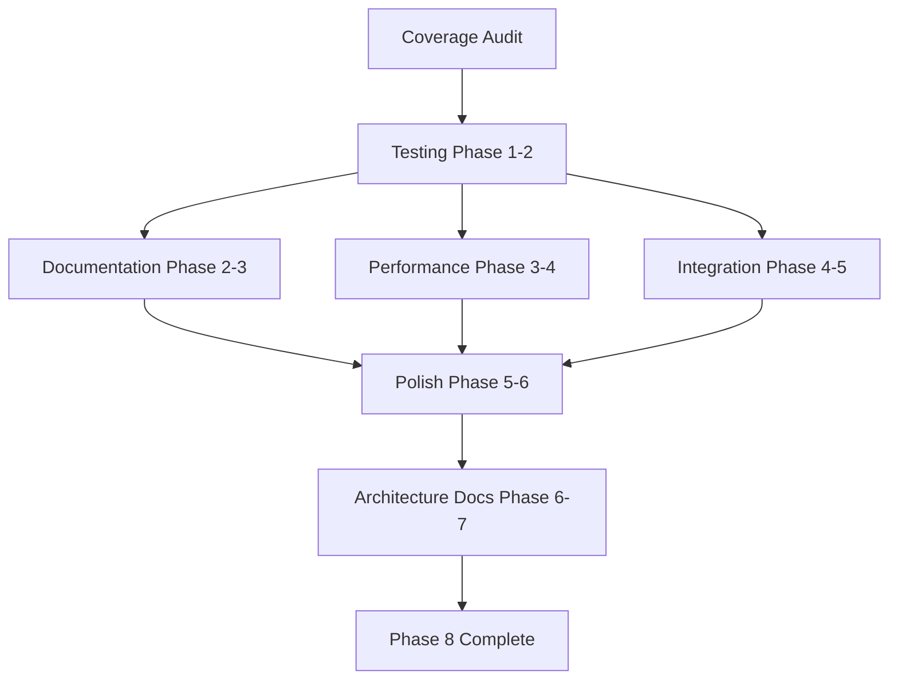

# Phase 8: Refinement & Polish - Decomposition

**Date**: 2025-11-09
**Phase**: 8 Decomposition
**Dependencies**: Coverage analysis complete

## Current Coverage Analysis

### ✅ Excellent Coverage (80%+) - Maintain
- `analyze/export`: 97.9%
- `memorygraph`: 96.8%
- `analyze/visualizations`: 93.7%
- `editor/syntax`: 93.4%
- `editor/search`: 90.2%
- `editor/buffer`: 89.9%
- `palette`: 88.3%

### ⚠️ Good Coverage (70-80%) - Minor Improvement
- `analyze`: 79.1% → **Target: 85%**
- `overlay`: 78.7% → **Target: 85%**
- `editor`: 74.0% → **Target: 80%**
- `context`: 74.9% → **Target: 80%**
- `memorydetail`: 73.2% → **Target: 80%**
- `orchestrate`: 73.1% → **Target: 85%**
- `memorylist`: 70.7% → **Target: 80%**

### 🔴 Needs Significant Work (50-70%) - Priority Focus
- `modes`: 54.7% → **Target: 75%** (+20.3%)
- `layout`: 54.5% → **Target: 75%** (+20.5%)
- `app/events`: 53.0% → **Target: 75%** (+22.0%)
- `mnemosyne`: 52.2% → **Target: 75%** (+22.8%)

### 📊 Other Packages
- `gliner`: 82.6% (good)
- `editor/semantic`: 81.7% (good)

---

## Work Streams Decomposition

### Stream 1: High-Priority Testing (Days 1-2)

**Goal**: Bring 50-70% packages to 75%+

#### Stream 1A: `mnemosyne` Package (Agent 1 - Sonnet)
**Current**: 52.2% | **Target**: 75% | **Gap**: +22.8%

**Files needing tests**:
1. `client.go` - Connection management, retries
2. `connection_pool.go` - Pool lifecycle, health checks
3. `recall.go` - Semantic search queries
4. `remember.go` - Memory storage operations
5. `evolve.go` - Memory evolution, consolidation

**Test Scenarios**:
- Connection failure and retry logic
- Pool exhaustion handling
- Concurrent recall operations
- Memory decay and archival
- Error recovery

**Estimated**: 25-30 new tests

---

#### Stream 1B: `modes` Package (Agent 2 - Haiku)
**Current**: 54.7% | **Target**: 75% | **Gap**: +20.3%

**Files needing tests**:
1. `registry.go` - Mode switching, lifecycle
2. `explore_mode.go` - Explore mode stub
3. Base mode integration tests

**Test Scenarios**:
- Mode registration and retrieval
- Mode switching with OnEnter/OnExit
- Previous mode navigation
- Concurrent mode operations
- Invalid mode handling

**Estimated**: 15-20 new tests

---

#### Stream 1C: `layout` Package (Agent 3 - Haiku)
**Current**: 54.5% | **Target**: 75% | **Gap**: +20.5%

**Files needing tests**:
1. `engine.go` - Layout engine lifecycle
2. `layouts.go` - Different layout types
3. `component.go` - Component management
4. `focus.go` - Focus navigation

**Test Scenarios**:
- Layout switching
- Component registration and rendering
- Focus traversal (Tab/Shift+Tab)
- Window resize handling
- Component visibility toggling

**Estimated**: 20-25 new tests

---

#### Stream 1D: `app/events` Package (Agent 4 - Haiku)
**Current**: 53.0% | **Target**: 75% | **Gap**: +22.0%

**Files needing tests**:
1. `broker.go` - Event brokering, subscriptions
2. `types.go` - Event types and handlers
3. Concurrent event delivery

**Test Scenarios**:
- Subscription management
- Event publishing and delivery
- Subscriber removal
- Concurrent publish/subscribe
- Event queue overflow

**Estimated**: 15-20 new tests

---

### Stream 2: Documentation (Days 2-3)

**Goal**: Comprehensive user guides for Edit and Analyze modes

#### Stream 2A: Edit Mode Guide (Agent 5 - Haiku)
**Target**: 600+ lines

**Sections**:
1. Overview and features
2. Keyboard shortcuts reference
3. Buffer management (multi-buffer editing)
4. Search functionality (regex, case-sensitivity)
5. Semantic analysis integration
6. Syntax highlighting
7. Context panel usage
8. Terminal integration
9. Example workflows
10. Troubleshooting

**Deliverable**: `docs/edit-mode-guide.md`

---

#### Stream 2B: Analyze Mode Guide (Agent 6 - Haiku)
**Target**: 600+ lines

**Sections**:
1. Overview and triple analysis
2. Entity extraction (persons, organizations, locations)
3. Relationship identification
4. Graph visualization
5. Navigation and filtering
6. Export capabilities (JSON, CSV, GraphML)
7. Integration with mnemosyne
8. Example analyses
9. Best practices
10. Troubleshooting

**Deliverable**: `docs/analyze-mode-guide.md`

---

### Stream 3: Performance Optimization (Days 3-4)

**Goal**: Profile and optimize critical paths

#### Stream 3A: Performance Profiling (Agent 7 - Sonnet)

**Tasks**:
1. CPU profiling (pprof)
2. Memory profiling
3. Benchmark suite creation
4. Identify bottlenecks
5. Implement optimizations
6. Document results

**Focus Areas**:
- Graph layout algorithms (analyze & orchestrate)
- Event processing latency
- Semantic analysis performance
- Memory allocations in hot paths

**Deliverables**:
- 15+ benchmarks
- Performance report
- `docs/PERFORMANCE.md`

---

### Stream 4: Integration Testing (Days 4-5)

**Goal**: E2E tests across modes and workflows

#### Stream 4A: Integration Test Framework (Agent 8 - Haiku)

**Test Scenarios**:
1. Edit → Analyze workflow
2. Analyze → Orchestrate workflow
3. Session persistence across restarts
4. Error recovery (crashes, corrupt data)
5. Large dataset handling (1000+ entities)

**Infrastructure**:
- Test fixtures (example content)
- Mock mnemosyne server
- Test helpers and utilities

**Deliverables**:
- `internal/integration/` package
- 20+ integration tests
- Test documentation

---

### Stream 5: UI/UX Polish (Days 5-6)

**Goal**: Consistent, polished experience

#### Stream 5A: Style Guide & Polish (Agent 9 - Haiku)

**Tasks**:
1. Create visual style guide
2. Audit UI consistency
3. Standardize colors and spacing
4. Improve error messages
5. Add contextual help (`?` key)
6. Loading states and progress indicators

**Deliverables**:
- `docs/STYLE_GUIDE.md`
- Help overlays for all modes
- Improved error messages (50+)

---

### Stream 6: Architecture Documentation (Days 6-7)

**Goal**: Developer onboarding and architecture docs

#### Stream 6A: Architecture & Development Guides (Agent 10 - Haiku)

**Documents**:
1. `docs/architecture.md` - System architecture
2. `docs/DEVELOPMENT.md` - Developer guide
3. `docs/CONTRIBUTING.md` - Contribution guidelines
4. `docs/TESTING.md` - Testing guide

**Sections**:
- Component overview
- Data flow diagrams
- Mode architecture
- Testing strategies
- Code style guidelines
- PR process

---

## Parallel Execution Plan

### Phase 1: Foundation Testing (Days 1-2)

**Parallel agents** (4 agents running simultaneously):
- Agent 1 (Sonnet): `mnemosyne` tests (25-30 tests)
- Agent 2 (Haiku): `modes` tests (15-20 tests)
- Agent 3 (Haiku): `layout` tests (20-25 tests)
- Agent 4 (Haiku): `app/events` tests (15-20 tests)

**Total**: 75-95 new tests in parallel

**Safety**: All agents work on different packages (zero conflicts)

---

### Phase 2: Documentation (Days 2-3)

**Parallel agents** (2 agents):
- Agent 5 (Haiku): Edit Mode guide
- Agent 6 (Haiku): Analyze Mode guide

**Safety**: Separate markdown files (zero conflicts)

---

### Phase 3: Optimization & Integration (Days 3-5)

**Parallel agents** (2 agents):
- Agent 7 (Sonnet): Performance profiling and optimization
- Agent 8 (Haiku): Integration test framework

**Safety**: Different focus areas (benchmarks vs. integration tests)

---

### Phase 4: Polish & Architecture Docs (Days 5-7)

**Parallel agents** (2 agents):
- Agent 9 (Haiku): UI/UX polish
- Agent 10 (Haiku): Architecture documentation

**Safety**: Code changes vs. documentation (low conflict risk)

---

## Dependency Graph

**Critical Path**: A → B → D → F → G → H (7 days)

**Parallelizable**:
- Testing (4 agents)
- Documentation (2 agents)
- Optimization + Integration (2 agents)
- Polish + Architecture (2 agents)

---

## Test Plan Breakdown

### Unit Tests (Target: 75-95 new tests)

**By Package**:
- `mnemosyne`: 25-30 tests
- `layout`: 20-25 tests
- `modes`: 15-20 tests
- `app/events`: 15-20 tests

**Test Types**:
- Happy path: 40%
- Error cases: 30%
- Edge cases: 20%
- Concurrency: 10%

---

### Integration Tests (Target: 20+ tests)

**Scenarios**:
1. Cross-mode workflows (5 tests)
2. Session persistence (3 tests)
3. Error recovery (4 tests)
4. Large datasets (3 tests)
5. Concurrent operations (5 tests)

---

### Benchmarks (Target: 15+ benchmarks)

**Focus Areas**:
- Graph layout: 4 benchmarks
- Event processing: 3 benchmarks
- Semantic analysis: 3 benchmarks
- Memory operations: 3 benchmarks
- JSON parsing: 2 benchmarks

---

## Deliverables Checklist

### Code
- [ ] 75-95 new unit tests
- [ ] 20+ integration tests
- [ ] 15+ benchmarks
- [ ] UI polish changes (50+ improvements)

### Documentation (3,000+ lines)
- [ ] `docs/edit-mode-guide.md` (600+ lines)
- [ ] `docs/analyze-mode-guide.md` (600+ lines)
- [ ] `docs/architecture.md` (400+ lines)
- [ ] `docs/DEVELOPMENT.md` (500+ lines)
- [ ] `docs/CONTRIBUTING.md` (300+ lines)
- [ ] `docs/TESTING.md` (300+ lines)
- [ ] `docs/PERFORMANCE.md` (300+ lines)
- [ ] `docs/STYLE_GUIDE.md` (200+ lines)

### Infrastructure
- [ ] Coverage reporting (HTML + badge)
- [ ] Benchmark suite
- [ ] Integration test framework
- [ ] CI/CD enhancements

---

## Risk Mitigation

### Testing Risks
- **Risk**: Adding tests changes code behavior
- **Mitigation**: Test existing behavior only, no refactoring

### Performance Risks
- **Risk**: Optimizations introduce bugs
- **Mitigation**: Benchmarks before/after, comprehensive testing

### Documentation Risks
- **Risk**: Docs become outdated quickly
- **Mitigation**: Reference actual code, include version numbers

---

## Success Metrics

**Quantitative**:
- Overall coverage: 50-70% → 75%+ (packages below 70%)
- New tests: 95+ passing
- Benchmarks: 15+ with baselines
- Documentation: 3,000+ lines

**Qualitative**:
- User guides are comprehensive
- Error messages are clear
- UI is visually consistent
- Code is well-documented

---

**Last Updated**: 2025-11-09
**Phase**: 8 Decomposition
**Status**: Ready for Execution Planning
