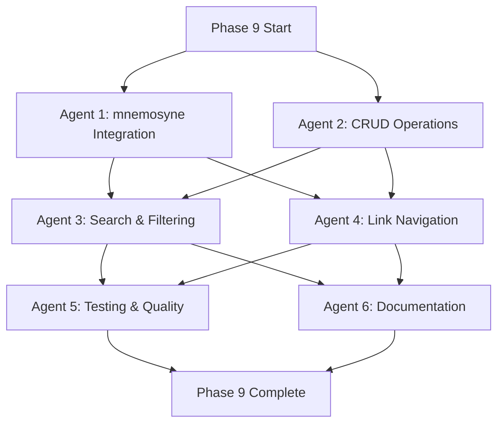

# Phase 9: Explore Mode - Decomposition

**Date**: 2025-11-09
**Phase**: 9 Decomposition
**Dependencies**: Phase 8 complete, Phase 9 specification reviewed

## Current State Analysis

### ✅ Existing Infrastructure (Complete)
- **Mode Framework**: BaseMode, registry, lifecycle hooks
- **UI Components**: memorylist, memorydetail, memorygraph
- **Layout System**: Standard (list+detail) and Graph (full-screen)
- **Navigation**: Keyboard shortcuts, focus management, help overlays
- **Sample Data**: Demo memories and graph for development

### ❌ Missing Implementation (Needs Work)
- **mnemosyne Integration**: Sample data → Real API calls
- **CRUD Operations**: Create, Update, Delete memories
- **Search & Filtering**: Text, tags, importance, namespace filters
- **Link Management**: Create, delete, navigate links
- **Offline Support**: Queue operations, sync when online
- **Complete Testing**: Unit, integration, benchmarks
- **User Documentation**: Explore Mode guide

---

## Work Streams Decomposition

### Stream 1: mnemosyne Integration (Agent 1 - Sonnet)

**Goal**: Replace sample data with real mnemosyne API calls

**Current State**: 52.2% coverage from Phase 8 (needs improvement)

**Files to Modify**:
1. `internal/memorylist/realdata.go` - Real data loading
2. `internal/memorydetail/crud.go` - Memory detail loading
3. `internal/memorygraph/loader.go` - **NEW FILE** - Graph traversal
4. `internal/modes/explore.go` - Replace `loadSampleMemories()` and `loadSampleGraph()`

**Implementation Tasks**:

#### Task 1.1: List Loading (memorylist/realdata.go)
```go
func LoadMemories(client mnemosyne.Client, namespace string, limit, offset int) tea.Cmd {
    return func() tea.Msg {
        ctx := context.Background()
        resp, err := client.List(ctx, &pb.ListRequest{
            Namespace: namespace,
            Limit:     uint32(limit),
            Offset:    uint32(offset),
        })
        if err != nil {
            return MemoriesLoadedMsg{Error: err}
        }
        return MemoriesLoadedMsg{
            Memories:   resp.Memories,
            TotalCount: resp.TotalCount,
        }
    }
}
```

#### Task 1.2: Detail Loading (memorydetail/crud.go)
```go
func LoadMemory(client mnemosyne.Client, memoryID string) tea.Cmd {
    return func() tea.Msg {
        ctx := context.Background()
        resp, err := client.Get(ctx, &pb.GetRequest{Id: memoryID})
        if err != nil {
            return MemoryLoadedMsg{Error: err}
        }
        return MemoryLoadedMsg{Memory: resp.Memory}
    }
}
```

#### Task 1.3: Graph Traversal (memorygraph/loader.go - NEW)
```go
func LoadGraph(client mnemosyne.Client, rootID string, depth int) tea.Cmd {
    return func() tea.Msg {
        ctx := context.Background()
        resp, err := client.TraverseLinks(ctx, &pb.TraverseLinkRequest{
            RootId: rootID,
            Depth:  int32(depth),
        })
        if err != nil {
            return GraphLoadedMsg{Error: err}
        }
        // Build graph from traversal response
        graph := buildGraphFromTraversal(resp)
        return GraphLoadedMsg{Graph: graph}
    }
}
```

#### Task 1.4: Offline Support
- Use existing `connection_manager.go` offline mode
- Queue operations when `IsOffline() == true`
- Display offline indicator in UI
- Process queue when connection restored

**Expected Output**:
- 4 new functions for real data loading
- Offline mode integration
- Error handling with user messages
- 15+ tests for data loading

**Estimated**: 2 days (Agent 1 - Sonnet)

---

### Stream 2: CRUD Operations (Agent 2 - Haiku)

**Goal**: Implement Create, Update, Delete operations

**Current State**: Stubs in memorydetail/crud.go

**Files to Modify**:
1. `internal/memorydetail/crud.go` - CRUD implementation
2. `internal/memorydetail/form.go` - **NEW FILE** - Form UI
3. `internal/memorydetail/validation.go` - **NEW FILE** - Input validation
4. `internal/modes/explore.go` - Wire up CRUD messages

**Implementation Tasks**:

#### Task 2.1: Create Memory (memorydetail/crud.go)
```go
func CreateMemory(client mnemosyne.Client, content string, importance int, tags []string, namespace string) tea.Cmd {
    return func() tea.Msg {
        ctx := context.Background()
        resp, err := client.Store(ctx, &pb.StoreRequest{
            Content:    content,
            Importance: int32(importance),
            Tags:       tags,
            Namespace:  parseNamespace(namespace),
        })
        if err != nil {
            return MemoryCreatedMsg{Error: err}
        }
        return MemoryCreatedMsg{Memory: resp.Memory}
    }
}
```

#### Task 2.2: Update Memory (memorydetail/crud.go)
```go
func UpdateMemory(client mnemosyne.Client, memoryID string, content string, importance int, tags []string) tea.Cmd {
    return func() tea.Msg {
        ctx := context.Background()
        resp, err := client.Update(ctx, &pb.UpdateRequest{
            Id:         memoryID,
            Content:    content,
            Importance: int32(importance),
            Tags:       tags,
        })
        if err != nil {
            return MemoryUpdatedMsg{Error: err}
        }
        return MemoryUpdatedMsg{Memory: resp.Memory}
    }
}
```

#### Task 2.3: Delete Memory (memorydetail/crud.go)
```go
func DeleteMemory(client mnemosyne.Client, memoryID string) tea.Cmd {
    return func() tea.Msg {
        ctx := context.Background()
        _, err := client.Delete(ctx, &pb.DeleteRequest{Id: memoryID})
        if err != nil {
            return MemoryDeletedMsg{Error: err}
        }
        return MemoryDeletedMsg{MemoryID: memoryID}
    }
}
```

#### Task 2.4: Form UI (memorydetail/form.go - NEW)
- Text input for content (multiline)
- Number input for importance (0-10)
- Tag input (comma-separated)
- Namespace selector (dropdown)
- Submit and Cancel buttons
- Validation feedback

#### Task 2.5: Validation (memorydetail/validation.go - NEW)
```go
func ValidateMemory(content string, importance int, tags []string, namespace string) error {
    if len(content) < 1 || len(content) > 10000 {
        return fmt.Errorf("content must be 1-10,000 characters")
    }
    if importance < 0 || importance > 10 {
        return fmt.Errorf("importance must be 0-10")
    }
    for _, tag := range tags {
        if !isValidTag(tag) {
            return fmt.Errorf("invalid tag: %s (use alphanumeric + hyphens)", tag)
        }
    }
    // Validate namespace format
    return nil
}
```

**Expected Output**:
- Create, Update, Delete functions
- Form UI with validation
- Offline queue support
- 20+ tests for CRUD operations

**Estimated**: 2 days (Agent 2 - Haiku)

---

### Stream 3: Search & Filtering (Agent 3 - Haiku)

**Goal**: Comprehensive search and filtering

**Current State**: Stub in memorylist/search.go

**Files to Modify**:
1. `internal/memorylist/search.go` - Search implementation
2. `internal/memorylist/filter.go` - **NEW FILE** - Filter logic
3. `internal/memorylist/view.go` - Add search UI
4. `internal/modes/explore.go` - Wire up search messages

**Implementation Tasks**:

#### Task 3.1: Text Search (memorylist/search.go)
```go
func SearchMemories(memories []*pb.MemoryNote, query string, caseSensitive bool, useRegex bool) []*pb.MemoryNote {
    var results []*pb.MemoryNote
    for _, mem := range memories {
        if matchesQuery(mem.Content, query, caseSensitive, useRegex) {
            results = append(results, mem)
        }
    }
    return results
}
```

#### Task 3.2: Tag Filtering (memorylist/filter.go - NEW)
```go
func FilterByTags(memories []*pb.MemoryNote, tags []string, andLogic bool) []*pb.MemoryNote {
    // AND logic: memory must have ALL tags
    // OR logic: memory must have AT LEAST ONE tag
    var results []*pb.MemoryNote
    for _, mem := range memories {
        if matchesTags(mem.Tags, tags, andLogic) {
            results = append(results, mem)
        }
    }
    return results
}
```

#### Task 3.3: Importance Filtering (memorylist/filter.go)
```go
func FilterByImportance(memories []*pb.MemoryNote, minImportance, maxImportance int) []*pb.MemoryNote {
    var results []*pb.MemoryNote
    for _, mem := range memories {
        if mem.Importance >= int32(minImportance) && mem.Importance <= int32(maxImportance) {
            results = append(results, mem)
        }
    }
    return results
}
```

#### Task 3.4: Namespace Filtering (memorylist/filter.go)
```go
func FilterByNamespace(memories []*pb.MemoryNote, namespaceType string, namespaceName string) []*pb.MemoryNote {
    var results []*pb.MemoryNote
    for _, mem := range memories {
        if matchesNamespace(mem.Namespace, namespaceType, namespaceName) {
            results = append(results, mem)
        }
    }
    return results
}
```

#### Task 3.5: Search UI (memorylist/view.go)
- Search input bar at top
- Filter pills showing active filters
- Clear filter buttons
- Results count ("Showing 42 of 150 memories")
- Quick filter buttons (High/Medium/Low importance)

**Expected Output**:
- Text search with regex
- Tag, importance, namespace filtering
- Combined filter logic
- Search UI components
- 15+ tests for search/filtering

**Estimated**: 1 day (Agent 3 - Haiku)

---

### Stream 4: Link Management (Agent 4 - Haiku)

**Goal**: Create, delete, and navigate memory links

**Current State**: TODO in explore.go:170, stubs in memorydetail/links.go

**Files to Modify**:
1. `internal/memorydetail/links.go` - Link CRUD
2. `internal/modes/explore.go` - Link navigation and history
3. `internal/memorygraph/navigation.go` - **NEW FILE** - Graph interaction

**Implementation Tasks**:

#### Task 4.1: Create Link (memorydetail/links.go)
```go
func CreateLink(client mnemosyne.Client, sourceID, targetID string, strength float32, linkType string) tea.Cmd {
    return func() tea.Msg {
        ctx := context.Background()
        _, err := client.CreateLink(ctx, &pb.CreateLinkRequest{
            SourceId: sourceID,
            TargetId: targetID,
            Strength: strength,
            Type:     linkType,
        })
        if err != nil {
            return LinkCreatedMsg{Error: err}
        }
        return LinkCreatedMsg{SourceID: sourceID, TargetID: targetID}
    }
}
```

#### Task 4.2: Delete Link (memorydetail/links.go)
```go
func DeleteLink(client mnemosyne.Client, sourceID, targetID string) tea.Cmd {
    return func() tea.Msg {
        ctx := context.Background()
        _, err := client.DeleteLink(ctx, &pb.DeleteLinkRequest{
            SourceId: sourceID,
            TargetId: targetID,
        })
        if err != nil {
            return LinkDeletedMsg{Error: err}
        }
        return LinkDeletedMsg{SourceID: sourceID, TargetID: targetID}
    }
}
```

#### Task 4.3: Link Navigation (modes/explore.go)
```go
// Navigation history
type NavigationHistory struct {
    history []string  // Stack of memory IDs
    current int       // Current position in history
}

func (m *ExploreMode) navigateToMemory(memoryID string) tea.Cmd {
    // Add to history
    m.navHistory.history = append(m.navHistory.history[:m.navHistory.current+1], memoryID)
    m.navHistory.current = len(m.navHistory.history) - 1

    // Load memory
    return LoadMemory(m.mnemosyneClient, memoryID)
}

func (m *ExploreMode) navigateBack() tea.Cmd {
    if m.navHistory.current > 0 {
        m.navHistory.current--
        memoryID := m.navHistory.history[m.navHistory.current]
        return LoadMemory(m.mnemosyneClient, memoryID)
    }
    return nil
}

func (m *ExploreMode) navigateForward() tea.Cmd {
    if m.navHistory.current < len(m.navHistory.history)-1 {
        m.navHistory.current++
        memoryID := m.navHistory.history[m.navHistory.current]
        return LoadMemory(m.mnemosyneClient, memoryID)
    }
    return nil
}
```

#### Task 4.4: Graph Navigation (memorygraph/navigation.go - NEW)
```go
func (g *Model) ExpandNode(nodeID string, client mnemosyne.Client) tea.Cmd {
    // Load linked memories for this node
    return func() tea.Msg {
        ctx := context.Background()
        resp, err := client.GetLinks(ctx, &pb.GetLinksRequest{MemoryId: nodeID})
        if err != nil {
            return NodeExpandedMsg{Error: err}
        }
        return NodeExpandedMsg{NodeID: nodeID, Links: resp.Links}
    }
}

func (g *Model) CollapseNode(nodeID string) {
    // Hide children of this node
    node := g.graph.GetNode(nodeID)
    node.IsExpanded = false
    // Remove child nodes from rendering
}

func (g *Model) CenterOnNode(nodeID string) {
    // Calculate center position for this node
    // Pan viewport to center
}
```

#### Task 4.5: Breadcrumb Trail (modes/explore.go)
```go
func (m *ExploreMode) renderBreadcrumb() string {
    // Show navigation path: Root > Concept A > Detail A1
    // Max 5 levels, use ellipsis for deeper
    // Clickable (send message to navigate)
}
```

**Expected Output**:
- Create/delete links
- Navigation history (back/forward)
- Graph node expansion/collapse
- Breadcrumb trail UI
- 15+ tests for link management

**Estimated**: 1 day (Agent 4 - Haiku)

---

### Stream 5: Testing & Quality (Agent 5 - Sonnet)

**Goal**: 80%+ test coverage with integration tests

**Files to Create/Modify**:
- `internal/modes/explore_test.go` - Expand existing tests
- `internal/memorylist/*_test.go` - Expand coverage
- `internal/memorydetail/*_test.go` - CRUD and link tests
- `internal/memorygraph/*_test.go` - Graph operation tests
- `internal/integration/explore_test.go` - **NEW** - E2E tests

**Test Categories**:

#### Category 1: Unit Tests (40+ tests)
- Mode lifecycle (Init, OnEnter, OnExit)
- Layout switching (Standard ↔ Graph)
- Focus management (List ↔ Detail)
- CRUD operations (Create, Update, Delete)
- Link management (Create, Delete, Navigate)
- Search and filtering (all filter types)
- Graph operations (Load, Expand, Collapse)
- Validation (forms, input)
- Error handling (network failures, invalid input)

#### Category 2: Integration Tests (10+ tests)
```go
func TestExploreModeCRUDWorkflow(t *testing.T) {
    // 1. Setup mock mnemosyne server
    // 2. Create ExploreMode with client
    // 3. Create new memory
    // 4. Verify memory appears in list
    // 5. Update memory
    // 6. Verify updates reflected
    // 7. Delete memory
    // 8. Verify memory removed from list
}

func TestExploreModeSearchAndFilter(t *testing.T) {
    // 1. Load memories
    // 2. Apply text search
    // 3. Apply tag filter
    // 4. Apply importance filter
    // 5. Verify correct results
}

func TestExploreModeOfflineMode(t *testing.T) {
    // 1. Disconnect mnemosyne
    // 2. Create memory (should queue)
    // 3. Update memory (should queue)
    // 4. Reconnect mnemosyne
    // 5. Verify queue processed
}

func TestExploreModeLinkNavigation(t *testing.T) {
    // 1. Load memory with links
    // 2. Navigate to linked memory
    // 3. Verify navigation history
    // 4. Go back
    // 5. Go forward
}

func TestExploreModeGraphVisualization(t *testing.T) {
    // 1. Load graph
    // 2. Expand node
    // 3. Verify children loaded
    // 4. Collapse node
    // 5. Verify children hidden
}
```

#### Category 3: Benchmarks (5+ tests)
```go
func BenchmarkListLoading(b *testing.B) {
    // Benchmark loading 1000 memories
}

func BenchmarkSearchOperation(b *testing.B) {
    // Benchmark searching 1000 memories with regex
}

func BenchmarkGraphLayout(b *testing.B) {
    // Benchmark graph layout with 100 nodes
}
```

**Expected Output**:
- 40+ unit tests
- 10+ integration tests
- 5+ benchmarks
- 80%+ coverage for all packages
- All tests passing

**Estimated**: 2 days (Agent 5 - Sonnet)

---

### Stream 6: Documentation (Agent 6 - Haiku)

**Goal**: Complete user documentation (600+ lines)

**File to Create**:
- `docs/explore-mode-guide.md` - Comprehensive user guide

**Required Sections**:

1. **Overview and Features** (50 lines)
   - What is Explore Mode?
   - Key capabilities
   - When to use it

2. **Getting Started** (50 lines)
   - Entering Explore mode (keyboard: `3`)
   - Interface overview
   - Two layout modes

3. **Keyboard Shortcuts Reference** (100 lines)
   - Complete table of all shortcuts
   - Organized by category (Navigation, Display, Memory Operations, Search, Mode Switching)

4. **Memory Operations** (100 lines)
   - Creating new memories
   - Editing memories
   - Deleting memories
   - Memory validation rules

5. **Search and Filtering** (100 lines)
   - Text search (regex support)
   - Tag filtering
   - Importance filtering
   - Namespace filtering
   - Combined filters

6. **Link Management** (80 lines)
   - Creating links
   - Deleting links
   - Navigating links
   - Link types and strength

7. **Graph Visualization** (80 lines)
   - Pan and zoom
   - Expand/collapse nodes
   - Center on node
   - Navigation in graph

8. **Offline Mode** (50 lines)
   - How offline mode works
   - Operation queuing
   - Sync behavior

9. **Example Workflows** (150 lines)
   - Building a knowledge base
   - Project documentation
   - Research notes
   - Code reference library
   - Personal journal

10. **Troubleshooting** (60 lines)
    - Common issues
    - Solutions
    - Performance tips

11. **FAQ** (80 lines)
    - 15+ frequently asked questions

**Style**: Follow docs/orchestrate-mode-guide.md format

**Expected Output**:
- docs/explore-mode-guide.md (700+ lines)
- Updated README.md
- Well-structured with ToC
- Practical examples throughout

**Estimated**: 1 day (Agent 6 - Haiku)

---

## Dependency Graph



**Critical Path**: A → B1 → C1 → D1 → E (5 days)

**Parallelizable**:
- Phase 1 (Days 1-2): Agents 1-2 in parallel
- Phase 2 (Days 3-4): Agents 3-4 in parallel
- Phase 3 (Days 5-7): Agents 5-6 in parallel

---

## Test Plan Breakdown

### Unit Tests (Target: 40+ tests)

**By Package**:
- `modes/explore`: 10+ tests (lifecycle, layout, focus, navigation)
- `memorylist`: 10+ tests (loading, search, filtering)
- `memorydetail`: 10+ tests (CRUD, validation, links)
- `memorygraph`: 10+ tests (loading, expansion, navigation)

**Test Types**:
- Happy path: 40%
- Error cases: 30%
- Edge cases: 20%
- Concurrency: 10%

---

### Integration Tests (Target: 10+ tests)

**Scenarios**:
1. CRUD workflow (3 tests)
2. Search and filtering (2 tests)
3. Link navigation (2 tests)
4. Offline mode (2 tests)
5. Graph visualization (1 test)

---

### Benchmarks (Target: 5+ benchmarks)

**Focus Areas**:
- List loading: 1 benchmark
- Search operations: 1 benchmark
- Graph layout: 2 benchmarks
- Memory operations: 1 benchmark

---

## Deliverables Checklist

### Code
- [ ] mnemosyne integration (real data loading)
- [ ] CRUD operations (Create, Update, Delete)
- [ ] Search and filtering (text, tags, importance, namespace)
- [ ] Link management (create, delete, navigate)
- [ ] Offline support (queue operations)
- [ ] Navigation history (back/forward)
- [ ] Graph interaction (expand, collapse, center)
- [ ] 40+ unit tests
- [ ] 10+ integration tests
- [ ] 5+ benchmarks

### Documentation (700+ lines)
- [ ] docs/explore-mode-guide.md (comprehensive user guide)
- [ ] Updated README.md

### Infrastructure
- [ ] Mock mnemosyne server for testing
- [ ] Test fixtures (sample memories, graphs)
- [ ] Benchmark baselines

---

## Risk Mitigation

### Testing Risks
- **Risk**: mnemosyne server unavailable during testing
- **Mitigation**: Use mock server (httptest), offline mode

### Performance Risks
- **Risk**: Graph traversal too slow for large datasets
- **Mitigation**: Depth limits (max 5 levels), lazy loading, caching

### Integration Risks
- **Risk**: API changes in mnemosyne
- **Mitigation**: Use stable v1 API, error handling for incompatibilities

---

## Success Metrics

**Quantitative**:
- Overall coverage: 80%+ (modes, memorylist, memorydetail, memorygraph)
- New tests: 40+ unit, 10+ integration, 5+ benchmarks
- Documentation: 700+ lines
- Zero TODOs in production code

**Qualitative**:
- User guide is comprehensive and easy to follow
- CRUD operations are intuitive
- Search and filtering is responsive
- Offline mode works seamlessly
- Graph visualization is interactive and informative

---

**Last Updated**: 2025-11-09
**Phase**: 9 Decomposition
**Status**: Ready for Execution Planning

