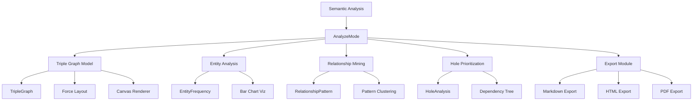
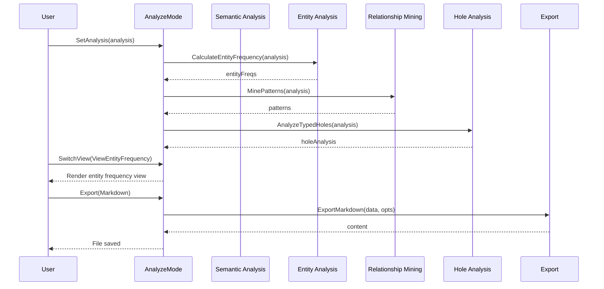

# Analyze Mode API Documentation

## Overview

This document provides comprehensive API documentation for the Analyze Mode components in Pedantic Raven. It covers core types, public interfaces, integration patterns, and architectural design.

**Target Audience**: Developers integrating with or extending Analyze Mode

**Related Files**:
- `/internal/analyze/analyze_mode.go` - Main mode coordinator
- `/internal/analyze/model.go` - Triple graph model
- `/internal/analyze/entity_analysis.go` - Entity frequency analysis
- `/internal/analyze/relationship_mining.go` - Pattern mining
- `/internal/analyze/hole_prioritization.go` - Typed hole analysis
- `/internal/analyze/export/` - Report generation

## Core Types

### AnalyzeMode

The main coordinator for all analysis views.

```go
type AnalyzeMode struct {
    // Current view mode
    currentView ViewMode

    // Shared analysis data
    analysis *semantic.Analysis

    // View components
    tripleGraphView Model

    // Cached analysis results
    entityFreqs    []EntityFrequency
    patterns       []RelationshipPattern
    holeAnalysis   *HoleAnalysis

    // UI state
    width  int
    height int
    err    error

    // Export state
    exportFormat ExportFormat
    lastExport   time.Time
}
```

**Purpose**: Coordinates multiple analysis views and manages shared state.

**Lifecycle**:
1. Create with `NewAnalyzeMode()`
2. Set analysis data with `SetAnalysis()`
3. Set size with `SetSize()`
4. Update with `Update()` (Bubble Tea pattern)
5. Render with `View()` (Bubble Tea pattern)

**Thread Safety**: Not thread-safe. Use from single goroutine (Bubble Tea main loop).

### ViewMode

Enum representing the different analysis views.

```go
type ViewMode int

const (
    ViewTripleGraph ViewMode = iota
    ViewEntityFrequency
    ViewPatterns
    ViewTypedHoles
)
```

**Usage**:
```go
mode := analyze.NewAnalyzeMode()
mode.SwitchView(analyze.ViewEntityFrequency)
```

### EntityFrequency

Represents frequency data for an entity.

```go
type EntityFrequency struct {
    Text       string                // Entity text
    Type       semantic.EntityType   // Entity type
    Count      int                   // Total occurrences
    Importance int                   // Importance score (0-10)
}
```

**Calculation**:
```go
freqs := analyze.CalculateEntityFrequency(analysis)
```

**Sorting**:
```go
list := analyze.FrequencyList(freqs)
list.SortByFrequency()  // Sort by count
list.SortByType()       // Sort by type, then count
list.SortAlphabetical() // Sort alphabetically
```

**Filtering**:
```go
filtered := list.FilterByType(semantic.EntityPerson)
top10 := list.TopN(10)
minCount := list.FilterByMinCount(5)
```

### RelationshipPattern

Represents a discovered pattern in relationships.

```go
type RelationshipPattern struct {
    SubjectType   semantic.EntityType // Type of subject entities
    Predicate     string              // Relationship predicate
    ObjectType    semantic.EntityType // Type of object entities
    Occurrences   int                 // Pattern frequency
    AvgConfidence float64             // Average confidence
    Examples      []PatternExample    // Example instances
    Strength      float64             // Pattern strength (0.0-1.0)
}
```

**Mining**:
```go
patterns := analyze.MinePatterns(analysis)

// With custom options
opts := analyze.DefaultMiningOptions()
opts.MinOccurrences = 3
opts.MinConfidence = 0.7
patterns = analyze.MinePatternsWithOptions(analysis, opts)
```

**Strength Calculation**:
```
strength = (occurrences × avg_confidence × (1 + diversity_factor)) / total_relationships
```

### HoleAnalysis

Aggregates typed hole analysis data.

```go
type HoleAnalysis struct {
    Holes            []semantic.EnhancedTypedHole // All enhanced holes
    Dependencies     []HoleDependency             // Dependency relationships
    DependencyTree   *HoleNode                    // Dependency tree root
    ImplementOrder   []semantic.EnhancedTypedHole // Recommended order
    CriticalPath     []semantic.EnhancedTypedHole // Critical path holes
    TotalComplexity  int                          // Sum of complexities
    AveragePriority  float64                      // Average priority
    CircularDeps     [][]string                   // Circular dependency chains
}
```

**Analysis**:
```go
holeAnalysis := analyze.AnalyzeTypedHoles(analysis)

// Generate implementation roadmap
roadmap := analyze.GenerateImplementationRoadmap(holeAnalysis)
fmt.Println(roadmap)
```

### TripleGraph

Represents the entity-relationship graph.

```go
type TripleGraph struct {
    Nodes map[string]*TripleNode // Entity text -> node
    Edges []*TripleEdge          // Relationship edges
}
```

**Construction**:
```go
graph := analyze.BuildFromAnalysis(analysis)
graph.InitializeLayout()
graph.StabilizeLayout(50, 0.8) // 50 iterations, 0.8 damping
```

**Node Operations**:
```go
node := graph.GetNode("entityText")
outEdges := graph.GetEdgesFrom("entityText")
inEdges := graph.GetEdgesTo("entityText")
nodeCount := graph.NodeCount()
edgeCount := graph.EdgeCount()
```

**Filtering**:
```go
filter := analyze.Filter{
    EntityTypes: map[semantic.EntityType]bool{
        semantic.EntityPerson: true,
        semantic.EntityOrg:    true,
    },
    MinConfidence: 0.7,
    MinImportance: 5,
    SearchTerm:    "API",
}
filtered := graph.ApplyFilter(filter)
```

### Model (Triple Graph Component)

The Bubble Tea model for triple graph visualization.

```go
type Model struct {
    // Graph data
    graph *TripleGraph

    // Display state
    selectedNodeID string
    highlightedIDs map[string]bool

    // Viewport state
    offsetX float64
    offsetY float64
    zoom    float64
    width   int
    height  int

    // Layout state
    layoutSteps int
    damping     float64

    // Filter state
    filter Filter

    // UI state
    focused bool
    err     error

    // Analysis source
    analysis *semantic.Analysis
}
```

**Creation**:
```go
model := analyze.NewModel()
model.SetSize(120, 40)
model.SetAnalysis(analysis)
```

**Viewport Control**:
```go
model.Pan(10.0, 5.0)   // Pan by delta
model.Zoom(0.1)         // Zoom in
model.Zoom(-0.1)        // Zoom out
model.ResetView()       // Reset to defaults
model.AutoCenter()      // Center on graph
```

**Selection**:
```go
model.SelectNode("entityText")
node := model.SelectedNode()
nodeID := model.SelectedNodeID()
isHighlighted := model.IsHighlighted("entityText")
```

## Public API

### NewAnalyzeMode()

Creates a new analyze mode coordinator.

```go
func NewAnalyzeMode() *AnalyzeMode
```

**Returns**: Initialized `AnalyzeMode` with default settings

**Example**:
```go
mode := analyze.NewAnalyzeMode()
mode.SetSize(120, 40)
mode.SetAnalysis(semanticAnalysis)
```

### SetAnalysis()

Sets the semantic analysis data and updates all views.

```go
func (m *AnalyzeMode) SetAnalysis(analysis *semantic.Analysis)
```

**Parameters**:
- `analysis`: Semantic analysis results from the editor

**Side Effects**:
- Updates triple graph view
- Recalculates entity frequencies
- Mines relationship patterns
- Analyzes typed holes

**Example**:
```go
// Get analysis from semantic analyzer
analysis := semanticAnalyzer.Analyze(document)

// Set in analyze mode
mode.SetAnalysis(analysis)
```

### SetSize()

Sets the component size for responsive rendering.

```go
func (m *AnalyzeMode) SetSize(width, height int)
```

**Parameters**:
- `width`: Width in terminal columns
- `height`: Height in terminal rows

**Note**: Automatically adjusts for header/footer (reserves 4 rows)

**Example**:
```go
// On window resize
mode.SetSize(msg.Width, msg.Height)
```

### Update() / View()

Implements the Bubble Tea Model interface.

```go
func (m *AnalyzeMode) Update(msg tea.Msg) (*AnalyzeMode, tea.Cmd)
func (m *AnalyzeMode) View() string
```

**Pattern**: Standard Bubble Tea component pattern

**Example**:
```go
// In your Bubble Tea program
type MyProgram struct {
    analyzeMode *analyze.AnalyzeMode
}

func (p MyProgram) Update(msg tea.Msg) (tea.Model, tea.Cmd) {
    newMode, cmd := p.analyzeMode.Update(msg)
    p.analyzeMode = newMode
    return p, cmd
}

func (p MyProgram) View() string {
    return p.analyzeMode.View()
}
```

### Export Functions

Generate reports in various formats.

```go
// In export package
func ExportMarkdown(data *AnalysisData, opts ExportOptions) (string, error)
func ExportHTML(data *AnalysisData, opts ExportOptions) (string, error)
func ExportPDF(data *AnalysisData, opts ExportOptions) error
```

**Example**:
```go
import "github.com/rand/pedantic-raven/internal/analyze/export"

// Prepare data
data := &export.AnalysisData{
    Entities:      analysis.Entities,
    Relationships: analysis.Relationships,
    TypedHoles:    analysis.TypedHoles,
    EntityFreqs:   entityFreqs,
    Patterns:      patterns,
    HoleAnalysis:  holeAnalysis,
}

// Export to Markdown
opts := export.DefaultExportOptions()
opts.OutputPath = "analysis-report.md"
content, err := export.ExportMarkdown(data, opts)
if err != nil {
    log.Fatal(err)
}

// Write to file
os.WriteFile(opts.OutputPath, []byte(content), 0644)
```

## Integration Examples

### Example 1: Basic Usage

```go
package main

import (
    "github.com/rand/pedantic-raven/internal/analyze"
    "github.com/rand/pedantic-raven/internal/editor/semantic"
)

func main() {
    // Create analyze mode
    mode := analyze.NewAnalyzeMode()
    mode.SetSize(120, 40)

    // Get semantic analysis (from your semantic analyzer)
    analysis := &semantic.Analysis{
        Entities: []semantic.Entity{
            {Text: "John", Type: semantic.EntityPerson, Count: 5},
            {Text: "Acme Corp", Type: semantic.EntityOrganization, Count: 3},
            // ... more entities
        },
        Relationships: []semantic.Relationship{
            {Subject: "John", Predicate: "works_at", Object: "Acme Corp"},
            // ... more relationships
        },
        TypedHoles: []semantic.TypedHole{
            {Type: "AuthService", Constraint: "thread-safe"},
            // ... more holes
        },
    }

    // Set analysis data
    mode.SetAnalysis(analysis)

    // Switch to entity frequency view
    mode.SwitchView(analyze.ViewEntityFrequency)

    // Render (in Bubble Tea loop, this would be called automatically)
    output := mode.View()
    fmt.Println(output)
}
```

### Example 2: Custom Filtering

```go
package main

import (
    "github.com/rand/pedantic-raven/internal/analyze"
    "github.com/rand/pedantic-raven/internal/editor/semantic"
)

func main() {
    // Build graph from analysis
    graph := analyze.BuildFromAnalysis(analysis)

    // Create custom filter
    filter := analyze.Filter{
        EntityTypes: map[semantic.EntityType]bool{
            semantic.EntityPerson:       true,
            semantic.EntityOrganization: true,
        },
        MinConfidence: 0.8,
        MinImportance: 7,
        SearchTerm:    "tech",
    }

    // Apply filter
    filtered := graph.ApplyFilter(filter)

    // Initialize layout on filtered graph
    filtered.InitializeLayout()
    filtered.StabilizeLayout(100, 0.8)

    // Use filtered graph in model
    model := analyze.NewModel()
    model.SetGraph(filtered)

    fmt.Printf("Filtered to %d nodes\n", filtered.NodeCount())
}
```

### Example 3: Programmatic Export

```go
package main

import (
    "fmt"
    "os"

    "github.com/rand/pedantic-raven/internal/analyze"
    "github.com/rand/pedantic-raven/internal/analyze/export"
)

func main() {
    // Perform analysis
    entityFreqs := analyze.CalculateEntityFrequency(analysis)
    patterns := analyze.MinePatterns(analysis)
    holeAnalysis := analyze.AnalyzeTypedHoles(analysis)

    // Prepare export data
    data := &export.AnalysisData{
        Entities:      analysis.Entities,
        Relationships: analysis.Relationships,
        TypedHoles:    analysis.TypedHoles,
        EntityFreqs:   entityFreqs,
        Patterns:      patterns,
        HoleAnalysis:  holeAnalysis,
    }

    // Export to all formats
    formats := []struct {
        name     string
        exporter func(*export.AnalysisData, export.ExportOptions) (string, error)
        ext      string
    }{
        {"Markdown", export.ExportMarkdown, ".md"},
        {"HTML", export.ExportHTML, ".html"},
    }

    opts := export.DefaultExportOptions()

    for _, format := range formats {
        opts.OutputPath = fmt.Sprintf("report%s", format.ext)
        content, err := format.exporter(data, opts)
        if err != nil {
            fmt.Printf("Error exporting %s: %v\n", format.name, err)
            continue
        }

        if err := os.WriteFile(opts.OutputPath, []byte(content), 0644); err != nil {
            fmt.Printf("Error writing %s: %v\n", format.name, err)
            continue
        }

        fmt.Printf("Exported %s to %s\n", format.name, opts.OutputPath)
    }

    // Export PDF (different signature)
    opts.OutputPath = "report.pdf"
    if err := export.ExportPDF(data, opts); err != nil {
        fmt.Printf("Error exporting PDF: %v\n", err)
    } else {
        fmt.Println("Exported PDF to report.pdf")
    }
}
```

### Example 4: Pattern Mining with Options

```go
package main

import (
    "fmt"

    "github.com/rand/pedantic-raven/internal/analyze"
)

func main() {
    // Configure mining options
    opts := analyze.DefaultMiningOptions()
    opts.MinOccurrences = 3      // Only patterns appearing 3+ times
    opts.MinConfidence = 0.75     // Only high-confidence patterns
    opts.MaxExamples = 5          // Store up to 5 examples per pattern
    opts.ClusterThreshold = 0.8   // Stricter clustering

    // Mine patterns with options
    patterns := analyze.MinePatternsWithOptions(analysis, opts)

    fmt.Printf("Found %d patterns\n", len(patterns))

    // Display patterns
    for i, pattern := range patterns {
        fmt.Printf("\nPattern %d:\n", i+1)
        fmt.Printf("  [%s] %s [%s]\n",
            pattern.SubjectType,
            pattern.Predicate,
            pattern.ObjectType)
        fmt.Printf("  Occurrences: %d\n", pattern.Occurrences)
        fmt.Printf("  Confidence: %.2f\n", pattern.AvgConfidence)
        fmt.Printf("  Strength: %.3f\n", pattern.Strength)

        fmt.Println("  Examples:")
        for _, ex := range pattern.Examples {
            fmt.Printf("    %s → %s → %s\n", ex.Subject, ex.Predicate, ex.Object)
        }
    }

    // Cluster patterns
    clusters := analyze.ClusterPatterns(patterns, opts.ClusterThreshold)
    fmt.Printf("\nClustered into %d groups\n", len(clusters))

    for i, cluster := range clusters {
        fmt.Printf("\nCluster %d: %s\n", i+1, cluster.ClusterLabel)
        fmt.Printf("  Predicates: %v\n", cluster.Predicates)
        fmt.Printf("  Pattern count: %d\n", len(cluster.Patterns))
        fmt.Printf("  Strength: %.3f\n", cluster.Strength)
    }
}
```

## Architecture Overview

### Component Diagram



### Data Flow



### Extension Points

**Custom Views**:
Add new view modes by:
1. Defining new `ViewMode` constant
2. Adding case in `AnalyzeMode.View()` switch
3. Implementing render function
4. Adding keyboard shortcut

**Custom Visualizations**:
Extend visualization components in `/internal/analyze/visualizations/`:
```go
// Custom visualization
type CustomViz struct {
    data []CustomData
    // ... fields
}

func (v *CustomViz) Render(width, height int) string {
    // Rendering logic
}
```

**Custom Exporters**:
Add new export formats in `/internal/analyze/export/`:
```go
func ExportJSON(data *AnalysisData, opts ExportOptions) (string, error) {
    // JSON export logic
}
```

**Custom Filters**:
Extend `Filter` type with additional criteria:
```go
type Filter struct {
    // Existing fields
    EntityTypes   map[semantic.EntityType]bool
    MinConfidence float64

    // New custom filters
    DateRange     DateRange
    CustomPredicate func(*TripleNode) bool
}
```

## Performance Considerations

### Caching

Analysis results are cached in `AnalyzeMode`:
- Entity frequencies calculated once on `SetAnalysis()`
- Patterns mined once on `SetAnalysis()`
- Hole analysis performed once on `SetAnalysis()`

**Invalidation**: Cache invalidated when `SetAnalysis()` called with new data.

### Layout Performance

Force-directed layout is computationally expensive:
- Default: 50 iterations on initialization
- Stabilize: Additional 10 iterations per `s` keypress
- Complexity: O(n²) for repulsion, O(e) for attraction (n=nodes, e=edges)

**Optimization**:
- Spatial indexing for large graphs (>1000 nodes)
- Viewport culling (only render visible nodes)
- Layout caching (preserve positions across filters)

### Rendering Performance

Terminal rendering is fast but can be improved:
- Canvas size limited to viewport
- Line drawing uses Bresenham (efficient)
- Text rendering is direct (no buffering overhead)

**Best Practices**:
- Filter large graphs before rendering
- Use compact view modes for lists
- Limit visible rows in pattern/hole tables

## Testing

### Unit Testing

Test individual components:

```go
func TestCalculateEntityFrequency(t *testing.T) {
    analysis := &semantic.Analysis{
        Entities: []semantic.Entity{
            {Text: "John", Type: semantic.EntityPerson, Count: 5},
            {Text: "Jane", Type: semantic.EntityPerson, Count: 3},
        },
    }

    freqs := analyze.CalculateEntityFrequency(analysis)

    assert.Equal(t, 2, len(freqs))
    assert.Equal(t, "John", freqs[0].Text)
    assert.Equal(t, 5, freqs[0].Count)
}
```

### Integration Testing

Test component interactions:

```go
func TestAnalyzeModeIntegration(t *testing.T) {
    mode := analyze.NewAnalyzeMode()
    mode.SetSize(80, 40)

    analysis := loadTestAnalysis()
    mode.SetAnalysis(analysis)

    // Verify all caches populated
    assert.NotNil(t, mode.entityFreqs)
    assert.NotNil(t, mode.patterns)
    assert.NotNil(t, mode.holeAnalysis)

    // Verify view switching
    mode.SwitchView(analyze.ViewEntityFrequency)
    output := mode.View()
    assert.Contains(t, output, "Entity Frequency")
}
```

## Error Handling

### Common Errors

**Nil Analysis**:
```go
if m.analysis == nil {
    return helpStyle.Render("No analysis data available")
}
```

**Empty Data**:
```go
if len(m.entityFreqs) == 0 {
    return helpStyle.Render("No entities found")
}
```

**Export Failures**:
```go
if err != nil {
    m.err = err
    return ExportErrorMsg{Err: err}
}
```

### Error Recovery

Analyze Mode gracefully handles errors:
- Displays error messages in UI (red text)
- Preserves state on error
- Allows retry operations

## Migration Guide

### From Phase 5 to Phase 6

Phase 6 adds Analyze Mode. To integrate:

**1. Update Imports**:
```go
import "github.com/rand/pedantic-raven/internal/analyze"
```

**2. Create Mode Instance**:
```go
analyzeMode := analyze.NewAnalyzeMode()
```

**3. Wire into Mode Switcher**:
```go
case "3":
    return SwitchMode(ModeAnalyze)
```

**4. Set Analysis Data**:
```go
// After semantic analysis
analyzeMode.SetAnalysis(semanticAnalysis)
```

## Future Enhancements

Planned improvements:

1. **Real-time Analysis**: Watch file changes, update views automatically
2. **Comparison Mode**: Compare analyses between document versions
3. **AI Insights**: LLM-generated insights from patterns
4. **Custom Metrics**: User-defined analysis functions
5. **Export Templates**: Customizable report layouts
6. **Interactive Charts**: Mouse support for selection/filtering

## Related Documentation

- [User Guide](./analyze-mode-guide.md) - End-user documentation
- [Phase 6 Spec](./PHASE6_SPEC.md) - Technical specification
- [Semantic Analysis](../internal/editor/semantic/README.md) - Data source
- [Export Package](../internal/analyze/export/README.md) - Export formats

## Support

For issues or questions:
- Check examples in `/examples/analyze_demo.go`
- Review test files (`*_test.go`) for usage patterns
- Consult Phase 6 specification for design decisions
