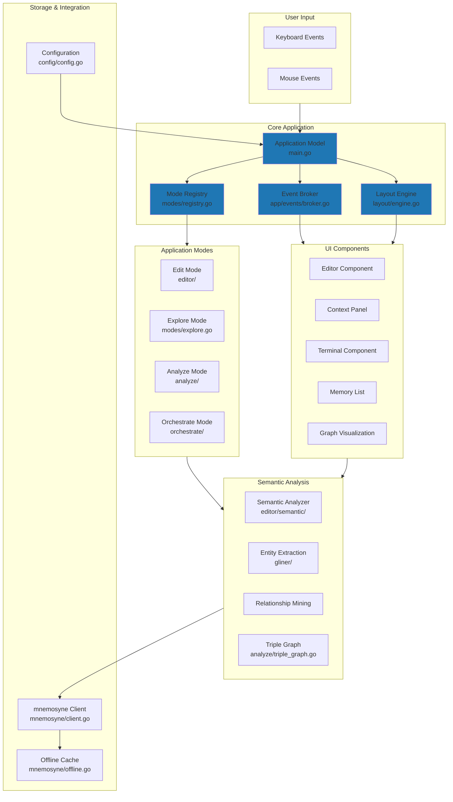
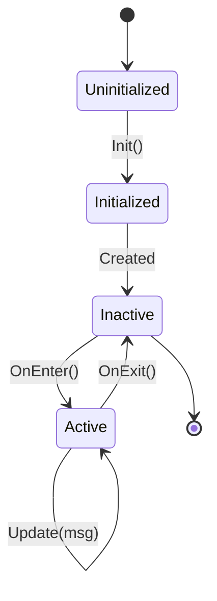
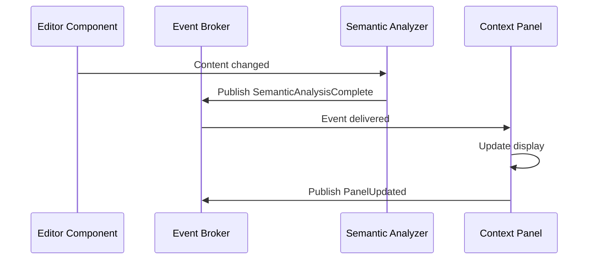
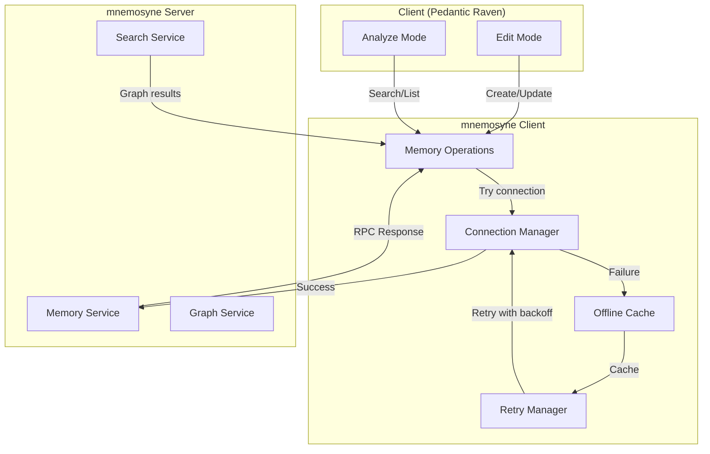
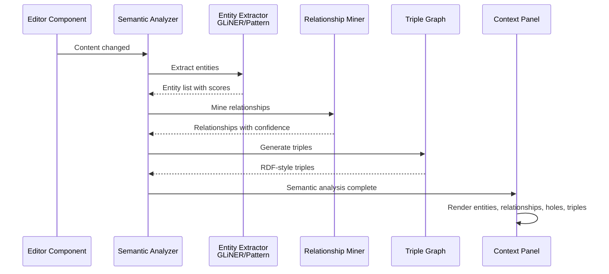
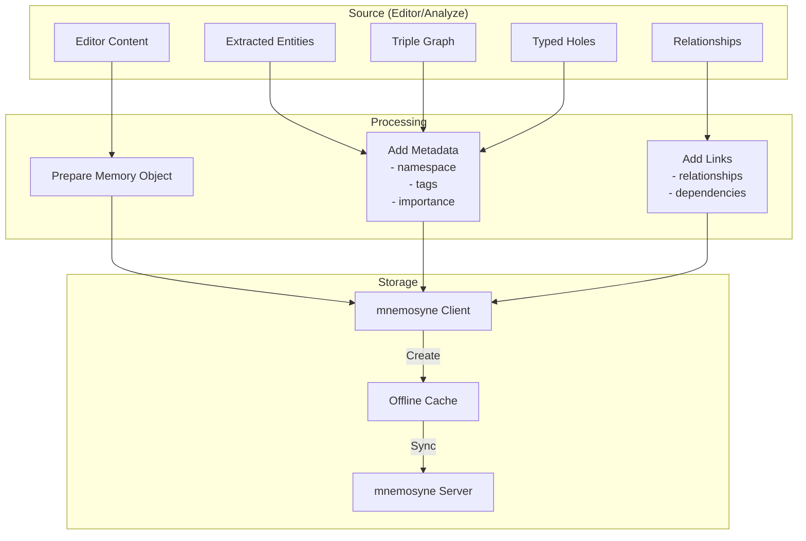
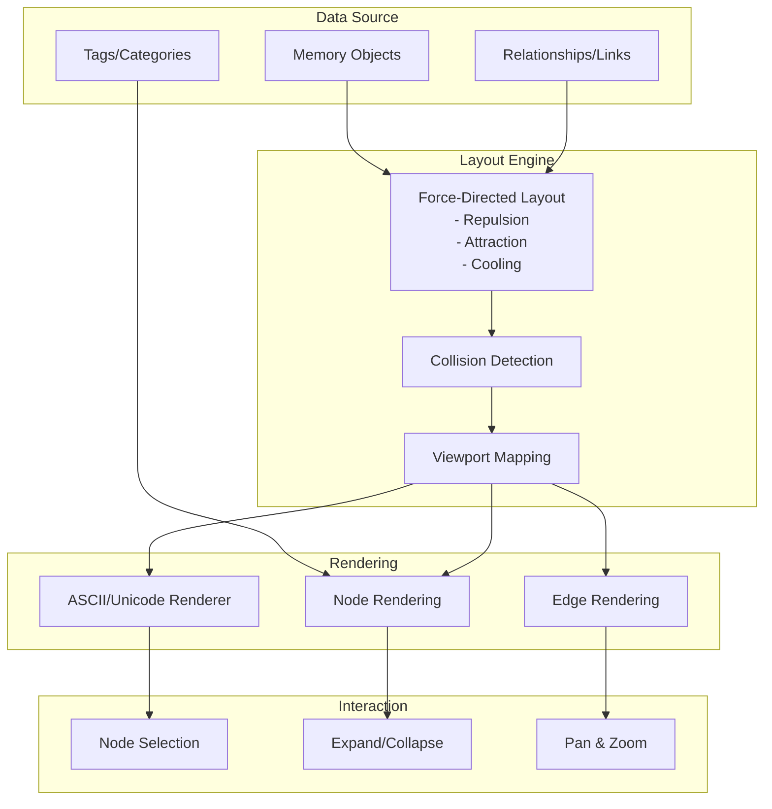

# Pedantic Raven Architecture Guide

**Version**: 1.0
**Last Updated**: November 9, 2025
**Status**: Complete

## Table of Contents

1. [System Overview](#system-overview)
2. [High-Level Architecture](#high-level-architecture)
3. [Component Architecture](#component-architecture)
4. [Data Flow](#data-flow)
5. [Package Structure](#package-structure)
6. [Design Patterns](#design-patterns)
7. [Key Abstractions](#key-abstractions)
8. [Integration Points](#integration-points)

---

## System Overview

**Pedantic Raven** is a terminal-based context engineering tool built with Go and Bubble Tea. It helps you create structured context documents for AI systems by providing real-time semantic analysis, entity extraction, relationship detection, and persistent memory integration.

### Core Capabilities

- **Rich Text Editing**: Multi-line editor with syntax highlighting, search/replace, and undo/redo
- **Semantic Analysis**: Extract entities, relationships, typed holes, dependencies, and RDF triples in real-time
- **Memory Integration**: Connect to mnemosyne semantic memory system for persistent storage and recall
- **Graph Visualization**: Visualize semantic relationships and memory networks with force-directed layouts
- **Multi-Mode UI**: Five specialized modes (Edit, Explore, Analyze, Orchestrate, Collaborate)
- **Integrated Terminal**: Execute commands and scripts from within the application

### Technology Stack

- **Language**: Go 1.25+
- **TUI Framework**: Bubble Tea (charmbracelet)
- **Styling**: Lipgloss (charmbracelet)
- **RPC**: gRPC with Protocol Buffers
- **Testing**: Go standard library + testify/assert
- **Configuration**: TOML

---

## High-Level Architecture

### System Architecture Diagram



---

## Component Architecture

### 1. Mode System

The application is organized around five specialized modes, each providing a different view and interaction model for working with context and memory.

#### Mode Registry
- **File**: `internal/modes/registry.go`
- **Responsibility**: Manages mode registration, switching, and lifecycle
- **Key Types**:
  - `ModeID`: Unique identifier (edit, explore, analyze, orchestrate, collaborate)
  - `Mode`: Interface defining mode behavior
  - `Registry`: Manages active mode and mode switching

#### Mode Interface
```go
type Mode interface {
    ID() ModeID
    Name() string
    Description() string
    Init() tea.Cmd
    OnEnter() tea.Cmd
    OnExit() tea.Cmd
    Update(msg tea.Msg) (Mode, tea.Cmd)
    View() string
}
```

#### Mode Lifecycle



#### Modes

**Edit Mode** (`internal/editor/`)
- Full-featured text editor with syntax highlighting
- Real-time semantic analysis with entity extraction
- Search and replace (literal, regex, whole-word)
- Undo/redo support
- Multi-buffer management
- Integrated terminal

**Explore Mode** (`internal/modes/explore.go`)
- Memory workspace for exploring stored memories
- Graph visualization with force-directed layout
- Memory search and filtering
- Node expansion/collapse
- Pan, zoom, and selection controls

**Analyze Mode** (`internal/analyze/`)
- Statistical analysis of extracted entities and relationships
- Pattern display and visualization
- Hole prioritization and complexity scoring
- Triple graph analysis
- Dependency tracking

**Orchestrate Mode** (`internal/orchestrate/`)
- Multi-agent task coordination
- Task graph and workflow management
- Agent logging and session tracking
- Plan editor for defining workflows
- Dashboard for monitoring task execution

**Collaborate Mode** (Future)
- Live multi-user editing
- Conflict resolution
- Real-time synchronization

### 2. Layout Engine

The layout system provides flexible multi-pane composition with dynamic adaptation to terminal size.

- **File**: `internal/layout/engine.go`
- **Responsibility**: Manage pane layout, focus, and rendering
- **Key Types**:
  - `Rect`: Rectangular area (X, Y, Width, Height)
  - `Direction`: Horizontal (side-by-side) or Vertical (top/bottom)
  - `LayoutMode`: Focus, Standard, Analysis, Compact, Custom
  - `PaneID`: Unique pane identifier
  - `Component`: Renderable UI component

#### Layout Modes

```
Focus Mode (LayoutFocus)
├─ Single pane takes full screen
└─ Used for deep work (editor, graph, etc.)

Standard Mode (LayoutStandard) [≥120x30 terminals]
├─ Main pane (60%)
└─ Sidebar pane (40%)

Analysis Mode (LayoutAnalysis) [≥120x30 terminals]
├─ Left pane (50%)
├─ Right pane (50%)
└─ For comparing/analyzing

Compact Mode (LayoutCompact) [<120x30 terminals]
├─ Main pane
└─ Sidebar becomes overlay
```

#### Pane IDs
- `PaneEditor`: Text editor
- `PaneSidebar`: Context panel, memory list
- `PaneDiagnostics`: Error/warning display
- `PaneMemory`: Memory detail view
- `PaneAnalysis`: Analysis results
- `PaneOrchestrate`: Orchestration panel
- `PaneChat`: Chat/messaging
- `PaneStatus`: Status bar

### 3. Event System

The event broker provides pub/sub event distribution for reactive updates and decoupled component communication.

- **File**: `internal/app/events/broker.go`
- **Responsibility**: Publish and subscribe to application events
- **Key Types**:
  - `Broker`: Main event coordinator
  - `Event`: Type + payload (JSON)
  - `EventType`: Enumeration of event types

#### Event Types
```go
const (
    SemanticAnalysisComplete EventType = "semantic.analysis.complete"
    EntityExtracted          EventType = "entity.extracted"
    RelationshipDetected     EventType = "relationship.detected"
    ModeChanged              EventType = "mode.changed"
    FileSaved                EventType = "file.saved"
    MemoryUpdated            EventType = "memory.updated"
    TerminalOutput           EventType = "terminal.output"
)
```

#### Event Flow



#### Broker Operations

- **Publish(event)**: Send event to all subscribers (non-blocking)
- **Subscribe(eventType)**: Get channel for specific event type
- **SubscribeAll()**: Get channel for all events
- **Unsubscribe(ch)**: Clean up subscription channel

### 4. mnemosyne Integration

The mnemosyne client provides persistent semantic memory with offline fallback.

- **File**: `internal/mnemosyne/client.go`
- **Responsibility**: Manage connection and operations with mnemosyne RPC server
- **Key Types**:
  - `Client`: Main mnemosyne client
  - `Config`: Client configuration
  - `Memory`: Memory object with content, metadata, links

#### Client Features

- **Full CRUD**: Create, read, update, delete, list memories
- **Advanced Search**: Hybrid, semantic, and graph traversal search
- **Streaming**: Progressive results for long-running queries
- **Offline Mode**: Local caching with automatic sync
- **Error Handling**: Retry logic with exponential backoff
- **Namespace Management**: Global, project, and session scopes

#### Connection Management
- **File**: `internal/mnemosyne/connection.go`
- Handles gRPC connection lifecycle
- Automatic reconnection with backoff
- Connection pooling and keep-alive

#### Offline Mode
- **File**: `internal/mnemosyne/offline.go`
- Local SQLite cache for offline operation
- Automatic sync when connection restored
- Write-through consistency

#### mnemosyne Integration Flow



---

## Data Flow

### Semantic Analysis Pipeline

The semantic analysis pipeline extracts entities, relationships, typed holes, dependencies, and triples from editor content in real-time.



### Memory Storage Pipeline

When saving context to mnemosyne, the application stores semantic artifacts.



### Graph Visualization Pipeline

The graph visualization system renders semantic relationships as interactive nodes and edges.



---

## Package Structure

### Top-Level Organization

```
pedantic-raven/
├── main.go                 # Application entry point
├── internal/
│   ├── app/               # Core application infrastructure
│   │   └── events/        # Event broker and types
│   ├── analyze/           # Analyze mode
│   ├── config/            # Configuration loading
│   ├── context/           # Context rendering utilities
│   ├── editor/            # Edit mode
│   │   ├── buffer/        # Text buffer management
│   │   ├── components.go  # UI components
│   │   ├── semantic/      # Semantic analysis
│   │   ├── search/        # Search and replace
│   │   ├── syntax/        # Syntax highlighting
│   │   └── gliner_e2e_*   # GLiNER integration tests
│   ├── gliner/            # Entity extraction service client
│   ├── integration/       # Integration test suite
│   ├── layout/            # Multi-pane layout engine
│   ├── memorydetail/      # Memory detail view component
│   ├── memorygraph/       # Graph visualization component
│   ├── memorylist/        # Memory list view component
│   ├── mnemosyne/         # mnemosyne client integration
│   │   └── pb/            # Generated protobuf code
│   ├── modes/             # Mode registry and management
│   ├── orchestrate/       # Orchestrate mode
│   ├── overlay/           # Overlay UI (search, file picker)
│   ├── palette/           # Command palette
│   └── terminal/          # Integrated terminal
├── proto/                 # Protocol buffer definitions
├── docs/                  # Documentation
└── examples/              # Example files
```

### Package Descriptions

#### app/events
Pub/sub event system for reactive component communication.
- `broker.go`: Event broker implementation
- `types.go`: Event type definitions
- `broker_test.go`: Broker tests
- `broker_benchmark_test.go`: Performance benchmarks

#### analyze
Semantic analysis mode with triple graph and insights.
- `analyze_mode.go`: Main mode implementation
- `triple_graph.go`: RDF-style semantic graph
- `entity_analysis.go`: Entity extraction and analysis
- `relationship_mining.go`: Relationship detection
- `hole_prioritization.go`: Typed hole scoring
- `pattern_display.go`: Visualization rendering

#### config
Configuration loading from TOML files with environment overrides.
- `config.go`: Configuration struct and loading logic

#### context
Context rendering utilities for displaying analysis results.
- `types.go`: Analysis result types
- `render.go`: Rendering logic

#### editor
Edit mode with text editing, syntax highlighting, and semantic analysis.
- `edit_mode.go`: Main mode implementation
- `components.go`: UI components (editor, context panel, terminal)
- `model.go`: Edit mode state
- `update.go`: Message handling
- `view.go`: Rendering
- `semantic/`: Semantic analysis pipeline
- `buffer/`: Text buffer management
- `search/`: Search and replace engine
- `syntax/`: Syntax highlighting
- `gliner_e2e_test.go`: End-to-end GLiNER tests

#### gliner
gRPC client for entity extraction service.
- `client.go`: Main client
- `types.go`: Data types
- `errors.go`: Error handling

#### integration
Integration test suite for end-to-end workflows.
- `helpers.go`: Test utilities
- `workflow_test.go`: Cross-mode workflows
- `persistence_test.go`: Session persistence
- `concurrent_test.go`: Concurrent operations
- `error_recovery_test.go`: Error recovery
- `large_dataset_test.go`: Large dataset handling

#### layout
Multi-pane layout engine with responsive adaptation.
- `engine.go`: Layout engine
- `types.go`: Layout types
- `layout_test.go`: Engine tests

#### memorydetail
Memory detail view component for exploring individual memories.
- `model.go`: Component state
- `crud.go`: CRUD operations
- `links.go`: Link management
- `view.go`: Rendering

#### memorygraph
Graph visualization component for semantic relationships.
- `layout.go`: Force-directed layout algorithm
- `model.go`: Graph state
- `types.go`: Graph data types
- `view.go`: ASCII/Unicode rendering

#### memorylist
Memory list view component for browsing memories.
- `model.go`: Component state
- `search.go`: Search and filtering
- `commands.go`: User commands
- `realdata.go`: Real data loading
- `view.go`: Rendering

#### mnemosyne
gRPC client for mnemosyne semantic memory system.
- `client.go`: Main client interface
- `memory.go`: Memory operations (CRUD)
- `messages.go`: Message types
- `connection.go`: Connection management
- `connection_manager.go`: Connection lifecycle
- `offline.go`: Offline caching
- `retry.go`: Retry logic with backoff
- `errors.go`: Error types
- `pb/`: Generated protobuf code

#### modes
Mode registry and lifecycle management.
- `registry.go`: Mode registry
- `explore.go`: Explore mode implementation
- `registry_test.go`: Registry tests
- `explore_test.go`: Explore mode tests

#### orchestrate
Orchestrate mode for multi-agent coordination.
- `orchestrate_mode.go`: Main mode implementation
- `task_graph.go`: Workflow task graph
- `agent_log.go`: Agent execution logging
- `session.go`: Session management
- `launcher.go`: Task launcher
- `plan_editor.go`: Workflow plan editor
- `dashboard.go`: Dashboard display
- `mode_adapter.go`: Mode integration adapter

#### overlay
Overlay UI components for search, file picking, etc.
- `search.go`: Search overlay
- `filepicker.go`: File picker overlay
- `manager.go`: Overlay lifecycle management

#### palette
Command palette for mode and command switching.
- `palette.go`: Main palette implementation
- `types.go`: Palette types

#### terminal
Integrated terminal for command execution.
- `executor.go`: Command execution
- `types.go`: Terminal types

---

## Design Patterns

### 1. Model-View-Update (MVU)

Pedantic Raven uses the Bubble Tea MVU pattern, inherited from Elm and popularized by Redux.

**Pattern Structure**:
```go
// Model: Application state
type Model struct {
    // ... state fields
}

// Update: Pure function that returns new state + commands
func (m Model) Update(msg tea.Msg) (tea.Model, tea.Cmd) {
    // Handle message
    // Return updated model + optional command to execute
}

// View: Pure function that renders state to string
func (m Model) View() string {
    // Return rendered output
}

// Commands: Asynchronous effects
func someCommand() tea.Cmd {
    return func() tea.Msg {
        // Do async work, return message
    }
}
```

**Benefits**:
- Pure state transitions (testable)
- Predictable data flow
- Time-travel debugging capability
- Composable components

**Example** (from `internal/editor/edit_mode.go`):
```go
type Model struct {
    editor     *editorComponent
    contextPanel *contextPanelComponent
    terminal   *terminalComponent
    // ... other state
}

func (m Model) Update(msg tea.Msg) (tea.Model, tea.Cmd) {
    switch msg := msg.(type) {
    case tea.KeyMsg:
        return m.handleKeyPress(msg)
    case SemanticAnalysisComplete:
        return m.handleAnalysisComplete(msg)
    }
    return m, nil
}
```

### 2. Pub/Sub Event Broker

The event broker enables loosely-coupled component communication.

**Pattern Structure**:
```go
// Publisher sends event to broker
broker.Publish(Event{
    Type: SemanticAnalysisComplete,
    Payload: analysisData,
})

// Subscribers receive events from their channels
eventCh := broker.Subscribe(SemanticAnalysisComplete)
defer broker.Unsubscribe(eventCh)
for event := range eventCh {
    // Handle event
}
```

**Benefits**:
- Components don't need to know about each other
- Easy to add new subscribers
- Supports multiple subscribers for same event
- Non-blocking publish (prevents deadlocks)

**Example** (from `internal/app/events/broker.go`):
```go
func (b *Broker) Publish(event Event) {
    b.mu.RLock()
    defer b.mu.RUnlock()

    // Send to type-specific subscribers
    if subs, ok := b.subscribers[event.Type]; ok {
        for _, ch := range subs {
            select {
            case ch <- event:
                // Event delivered
            default:
                // Channel full, drop event
            }
        }
    }
}
```

### 3. Registry Pattern

The mode registry manages mode registration, switching, and lifecycle.

**Pattern Structure**:
```go
type Registry struct {
    modes   map[ModeID]Mode
    current ModeID
}

func (r *Registry) Register(mode Mode) {
    r.modes[mode.ID()] = mode
}

func (r *Registry) Switch(to ModeID) tea.Cmd {
    current := r.modes[r.current]
    next := r.modes[to]

    return tea.Batch(
        current.OnExit(),
        next.OnEnter(),
    )
}
```

**Benefits**:
- Centralized mode management
- Decouples modes from each other
- Supports dynamic mode registration
- Clean mode switching with lifecycle hooks

**Example** (from `internal/modes/registry.go`):
```go
type Registry struct {
    modes   map[ModeID]Mode
    current ModeID
    mu      sync.RWMutex
}

func (r *Registry) Switch(to ModeID) tea.Cmd {
    r.mu.Lock()
    defer r.mu.Unlock()

    if _, ok := r.modes[to]; !ok {
        return nil
    }

    r.current = to
    return nil
}
```

### 4. Component Pattern

Reusable UI components implement a common interface.

**Pattern Structure**:
```go
type Component interface {
    Update(msg tea.Msg) (Component, tea.Cmd)
    View() string
    SetSize(width, height int)
}

type EditorComponent struct {
    // ... internal state
}

func (c *EditorComponent) Update(msg tea.Msg) (Component, tea.Cmd) {
    // Handle message, return updated component
}

func (c *EditorComponent) View() string {
    // Render component
}
```

**Benefits**:
- Encapsulation of component logic
- Reusability across modes
- Clear responsibilities
- Composable UI hierarchy

**Example** (from `internal/editor/components.go`):
```go
type EditorComponent struct {
    buffer  *Buffer
    viewport *viewport.Model
}

func (c *EditorComponent) View() string {
    return c.viewport.View()
}

func (c *EditorComponent) SetSize(width, height int) {
    c.viewport.Width = width
    c.viewport.Height = height
}
```

### 5. Middleware Pattern (Commands)

Bubble Tea commands provide a way to execute asynchronous effects.

**Pattern Structure**:
```go
// Command takes no arguments and returns a message when complete
type Cmd func() Msg

// Create a command
func semanticAnalysisCmd(content string) tea.Cmd {
    return func() tea.Msg {
        results := analyzeContent(content)
        return SemanticAnalysisComplete{results}
    }
}

// Execute command batch
func (m Model) Update(msg tea.Msg) (tea.Model, tea.Cmd) {
    return m, tea.Batch(
        semanticAnalysisCmd(text),
        updateContextPanelCmd(),
    )
}
```

**Benefits**:
- Asynchronous effects without callbacks
- Composable with `tea.Batch()`
- Results returned as messages
- Natural error handling

---

## Key Abstractions

### 1. Mode Interface

Every mode implements the `Mode` interface:
```go
type Mode interface {
    ID() ModeID
    Name() string
    Description() string
    Init() tea.Cmd
    OnEnter() tea.Cmd
    OnExit() tea.Cmd
    Update(msg tea.Msg) (Mode, tea.Cmd)
    View() string
}
```

**Implementations**:
- `EditMode` (internal/editor/)
- `ExploreMode` (internal/modes/explore.go)
- `AnalyzeMode` (internal/analyze/)
- `OrchestrateMode` (internal/orchestrate/)

### 2. Component Interface

UI components implement a common interface:
```go
type Component interface {
    Update(msg tea.Msg) (Component, tea.Cmd)
    View() string
    SetSize(width, height int)
}
```

**Implementations**:
- `EditorComponent` (editor buffer + viewport)
- `ContextPanelComponent` (semantic analysis results)
- `TerminalComponent` (integrated shell)
- `MemoryListComponent` (memory browser)
- `MemoryGraphComponent` (graph visualization)

### 3. Event Type

Events carry type and payload:
```go
type Event struct {
    Type    EventType       // Enumeration of event types
    Payload json.RawMessage // JSON serialized data
}
```

**Common Event Types**:
- `SemanticAnalysisComplete`
- `EntityExtracted`
- `RelationshipDetected`
- `ModeChanged`
- `FileSaved`
- `MemoryUpdated`
- `TerminalOutput`

### 4. Layout Types

Layout system provides flexible pane arrangement:
```go
type Rect struct {
    X, Y, Width, Height int
}

type Direction int // Horizontal or Vertical

type LayoutMode int // Focus, Standard, Analysis, Compact, Custom

type PaneID string // editor, sidebar, terminal, etc.
```

### 5. mnemosyne Client

Semantic memory client with offline support:
```go
type Client struct {
    conn *grpc.ClientConn
    memoryClient pb.MemoryServiceClient
    // ... connection management
}

// Operations
func (c *Client) CreateMemory(ctx, namespace, content string) (id string, err error)
func (c *Client) SearchMemories(ctx, query string) (results []Memory, err error)
func (c *Client) UpdateMemory(ctx, id, content string) error
func (c *Client) DeleteMemory(ctx, id string) error
func (c *Client) ListMemories(ctx, namespace string) (memories []Memory, err error)
```

---

## Integration Points

### Editor → Semantic Analysis

```go
// Editor content changes
editor.Update(ContentChangedMsg{content: newText})

// Triggers semantic analysis
semanticAnalyzer.Analyze(newText)

// Analysis complete, publishes event
broker.Publish(Event{
    Type: SemanticAnalysisComplete,
    Payload: analysisResults,
})

// Context panel subscribes and updates
contextPanel.Update(SemanticAnalysisComplete{...})
```

### Semantic Analysis → mnemosyne

```go
// User saves analysis results
editor.SaveCmd()

// Prepare memory object
memory := Memory{
    Content: analysisResults.String(),
    Metadata: Metadata{
        Namespace: "project:myapp",
        Tags: []string{"architecture", "entities"},
        Importance: 8,
    },
    Links: extractedRelationships,
}

// Store in mnemosyne
client.CreateMemory(ctx, memory)

// Offline mode caches locally
offlineCache.Put(memory.ID, memory)
```

### Mode Switching → Lifecycle

```go
// User presses key to switch modes
app.Update(ModeSelectMsg{target: ModeExplore})

// Registry handles switch
currentMode.OnExit()
nextMode.OnEnter()

// Next mode starts background tasks
exploreMode.OnEnter() // Returns cmd to load graph

// Command executes
loadGraphCmd() // Loads memories from mnemosyne
```

### Event Broker → Component Updates

```go
// Entity extracted from text
entity := Entity{name: "main", type: "function"}

// Publish event
broker.Publish(Event{
    Type: EntityExtracted,
    Payload: entity.JSON(),
})

// Multiple subscribers updated
contextPanel.Update(event) // Render entity list
orchestrateMode.Update(event) // Use in task dependencies
```

---

## Concurrency Model

### Thread Safety

**Event Broker**:
- Uses `sync.RWMutex` for subscriber map access
- Non-blocking publish (select with default)
- Safe for concurrent publishes and subscribes

**mnemosyne Client**:
- Connection pooling for concurrent requests
- gRPC handles multiplexing over single connection
- Offline cache uses mutex for consistency
- Retry manager uses exponential backoff

**Mode Registry**:
- Mutex protects mode map and current mode
- Mode switching is synchronous
- Each mode handles its own concurrency

### Async/Await Patterns

**Bubble Tea Commands**:
```go
// Async operation wrapped in command
func loadGraphCmd() tea.Cmd {
    return func() tea.Msg {
        memories := mnemosyne.ListMemories(ctx)
        return GraphLoadedMsg{memories}
    }
}

// Batch multiple operations
return m, tea.Batch(
    loadGraphCmd(),
    semanticAnalysisCmd(text),
    updateStatusCmd(),
)
```

**Example** (from `internal/mnemosyne/retry.go`):
```go
func (c *Client) withRetry(ctx context.Context, fn func() error) error {
    backoff := 100 * time.Millisecond
    for attempt := 0; attempt < c.config.MaxRetries; attempt++ {
        if err := fn(); err == nil {
            return nil
        }
        time.Sleep(backoff)
        backoff *= 2 // Exponential backoff
    }
    return errors.New("max retries exceeded")
}
```

---

## Performance Considerations

### 1. Event Buffering

Event broker buffers per subscriber to prevent blocking:
```go
// Large buffers for high-frequency events
broker := events.NewBroker(bufferSize: 100)

// Dropped events when buffer full:
// - Prevents blocking publishers
// - Trades event loss for responsiveness
// - Acceptable for UI updates (next update will be more current)
```

### 2. Lazy Loading

Modules load data on-demand:
- Memories loaded from mnemosyne only when needed
- Graph visualization layouts only when displayed
- Syntax highlighting cached per file

### 3. Caching

**mnemosyne Offline Cache**:
- Local SQLite database for read-through cache
- Automatic sync when connection restored
- Reduces latency for repeated queries

**Editor Syntax Highlighting**:
- Highlights cached per buffer state
- Invalidated only when content changes

### 4. Goroutine Management

**Command Execution**:
- Each command runs in separate goroutine
- Batch operations execute concurrently
- Results returned as messages

**Example** (from benchmarks):
```go
// Benchmark shows minimal overhead for event publishing
// Even with 1000 subscribers, publish completes in <1ms
BenchmarkPublish-8  1000000  1023 ns/op

// Large dataset handling (10,000+ memories)
// Graph layout computed in <100ms with force-directed algorithm
```

---

## Testing Strategy

### 1. Unit Tests

Individual package tests:
```bash
go test ./internal/app/events -v
go test ./internal/editor -v
go test ./internal/mnemosyne -v
```

### 2. Integration Tests

End-to-end workflow tests:
```bash
go test ./internal/integration -v
```

**Coverage**:
- Cross-mode workflows (Edit → Analyze → Orchestrate)
- Session persistence
- Error recovery
- Large dataset handling
- Concurrent operations

### 3. Benchmarks

Performance benchmarks:
```bash
go test -bench=. -benchmem ./internal/app/events
go test -bench=. -benchmem ./internal/analyze
```

---

## Summary

Pedantic Raven's architecture is built on:

1. **Multi-Mode System**: Specialized modes for different workflows
2. **Event-Driven**: Pub/sub broker for reactive updates
3. **Flexible Layout**: Responsive pane management
4. **Semantic Analysis**: Real-time extraction and insights
5. **Persistent Memory**: mnemosyne integration with offline support
6. **Pure Functional Updates**: Bubble Tea MVU pattern
7. **Component Composition**: Reusable UI building blocks

This design enables a powerful, responsive TUI application with clear separation of concerns and easy extensibility.

---

*For more details on specific modes, see the mode-specific guides in `docs/`.*
